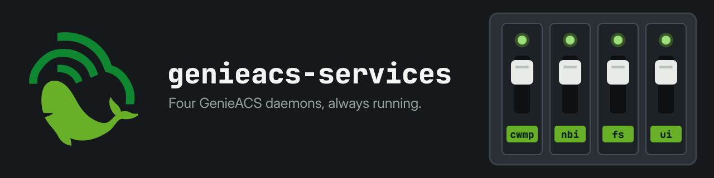

<p align="center">
  
</p>

<h1 align="center">GenieACS Services</h1>

<p align="center">
  <a href="https://github.com/GeiserX/genieacs-services/tags"></a>
  <a href="https://github.com/GeiserX/genieacs-services/blob/main/LICENSE"></a>
  <a href="https://github.com/GeiserX/genieacs-services/stargazers"></a>
</p>

<p align="center"><strong>Systemd and Supervisord service files for GenieACS.</strong></p>

If you would rather run GenieACS in Docker or Kubernetes, use [genieacs-container](https://github.com/GeiserX/genieacs-container); these files are for bare-metal installs.

## Quick start

On a host where GenieACS is installed under `/opt/genieacs` and a `genieacs` user exists:

```bash
git clone https://github.com/GeiserX/genieacs-services && cd genieacs-services
sudo cp genieacs-*.service /etc/systemd/system/ && sudo systemctl daemon-reload
sudo systemctl enable --now genieacs-cwmp genieacs-nbi genieacs-fs genieacs-ui
```

Follow the logs with `journalctl -f -u genieacs-cwmp`. For Supervisord, copy `supervisord.conf` to `/etc/supervisor/conf.d/` instead. The paths each file expects are in [Usage](docs/usage.md).

## Documentation

- [Usage](docs/usage.md): what each file runs, the paths it expects, `run_with_env.sh`, logs, which GenieACS version each tag targets

## Related projects

Part of the GenieACS family: [genieacs-container](https://github.com/GeiserX/genieacs-container), [genieacs-ansible](https://github.com/GeiserX/genieacs-ansible), [genieacs-mcp](https://github.com/GeiserX/genieacs-mcp), [genieacs-ha](https://github.com/GeiserX/genieacs-ha), [genieacs-sim-container](https://github.com/GeiserX/genieacs-sim-container). The full list is in [genieacs-container's related projects](https://github.com/GeiserX/genieacs-container/blob/main/docs/related.md).

## License

[GPL-3.0-or-later](LICENSE)
