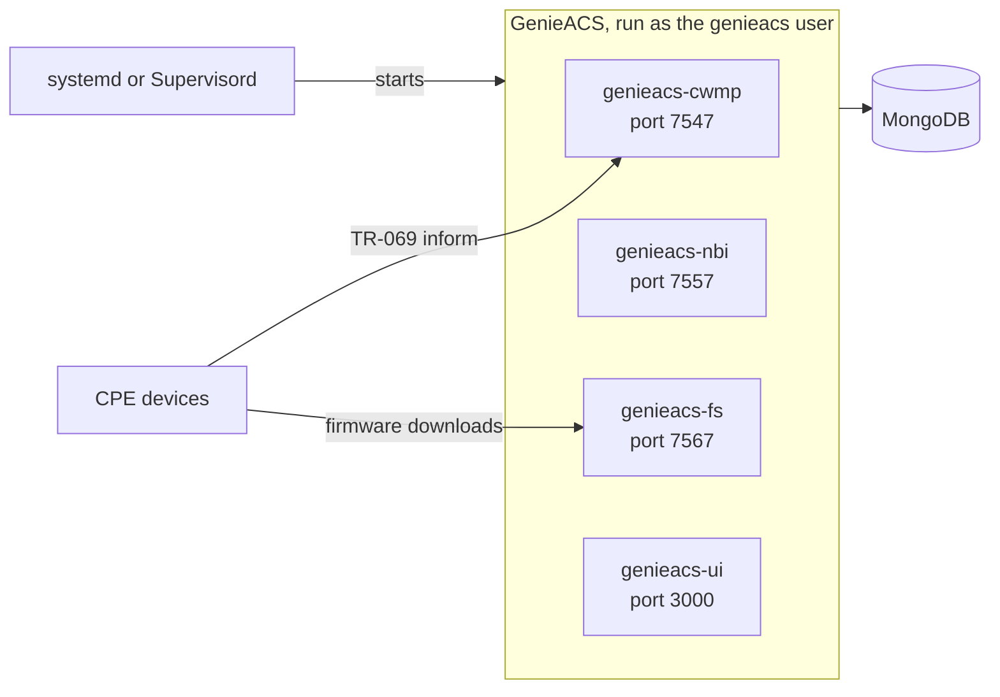

---
hide:
  - navigation
---

# genieacs-services { .gs-visually-hidden }

<p align="center">
  
</p>

<p align="center">
  <a href="https://github.com/GeiserX/genieacs-services/tags"></a>
  <a href="https://github.com/GeiserX/genieacs-services/stargazers"></a>
  <a href="https://github.com/GeiserX/genieacs-services/blob/main/LICENSE"></a>
</p>

---

**genieacs-services** holds the systemd units and the Supervisord config that run [GenieACS](https://genieacs.com), the open-source TR-069 ACS, on a Linux host without containers. GenieACS's installation guide has you paste four units into an editor one at a time; here they are as files you copy with one command, and the Supervisord config is the one the [genieacs-container](https://github.com/GeiserX/genieacs-container) image runs. Start with [Getting started](getting-started.md), then [Usage](usage.md).

<div class="grid cards" markdown>

-   :material-download: **[Getting started](getting-started.md)**

    ---

    Install GenieACS where the units look for it, copy the units, and check that the four services answer.

-   :material-console: **[Usage](usage.md)**

    ---

    Start, stop, logs and updates with systemd, and the two ways to run the Supervisord config.

-   :material-tune: **[Configuration](configuration.md)**

    ---

    The paths and user each file expects, a different install path, and the GenieACS environment file.

-   :material-lifebuoy: **[Troubleshooting](troubleshooting.md)**

    ---

    Symptoms seen on a real install, what causes each, and the fix.

</div>

## What a working install looks like

The README's three commands on a fresh Ubuntu 24.04 host with GenieACS 1.2.16 and MongoDB 8.0:

```console
$ systemctl status genieacs-cwmp genieacs-nbi genieacs-fs genieacs-ui --no-pager --lines=0 | grep -E '●|Active'
● genieacs-cwmp.service - GenieACS CWMP
     Active: active (running) since Wed 2026-09-30 20:40:30 CEST; 8s ago
● genieacs-nbi.service - GenieACS NBI
     Active: active (running) since Wed 2026-09-30 20:40:30 CEST; 8s ago
● genieacs-fs.service - GenieACS FS
     Active: active (running) since Wed 2026-09-30 20:40:30 CEST; 8s ago
● genieacs-ui.service - GenieACS UI
     Active: active (running) since Wed 2026-09-30 20:40:30 CEST; 8s ago
$ curl -s -o /dev/null -w '%{http_code}\n' http://127.0.0.1:7557/devices
200
```

Four `active (running)` lines and a `200` from the northbound API. [Getting started](getting-started.md#check-that-it-works) shows the rest of the check.

## How it runs



- Each systemd unit runs one GenieACS service as the `genieacs` user, with its settings from `/opt/genieacs/genieacs.env`. The four are independent; they share only MongoDB.
- Each service starts one primary process, which forks one worker per CPU core by default.
- The Supervisord config runs the same four services and restarts any that exits. The systemd units do not restart a crashed service.
- [How it works](how-it-works.md) goes through the files line by line and shows how the units differ from GenieACS's own.

## What it does not do

- It does not install GenieACS, Node.js or MongoDB. [Getting started](getting-started.md#install-genieacs-where-the-units-expect-it) shows the one command that puts GenieACS where the units look.
- The units do not wait for MongoDB. If it is down, the services still show `active` while their workers die; see [Troubleshooting](troubleshooting.md#workers-die-with-mongoserverselectionerror).
- It does not rotate logs or set up TLS. GenieACS's [installation guide](https://docs.genieacs.com/en/latest/installation-guide.html) has a logrotate config, and its [HTTPS page](https://docs.genieacs.com/en/latest/https.html) covers certificates.
- For Docker or Kubernetes, use [genieacs-container](https://github.com/GeiserX/genieacs-container) instead.

## Getting help

- Something broken: [Troubleshooting](troubleshooting.md), then an [issue](https://github.com/GeiserX/genieacs-services/issues) with what its "Reporting a bug" section lists.
- A security problem: the [security policy](https://github.com/GeiserX/genieacs-services/blob/main/SECURITY.md), never a public issue.
- The GenieACS family: [genieacs-container](https://github.com/GeiserX/genieacs-container) (Docker image and Helm chart), [genieacs-ansible](https://github.com/GeiserX/genieacs-ansible) (Ansible collection), [genieacs-mcp](https://github.com/GeiserX/genieacs-mcp) (MCP server), [genieacs-ha](https://github.com/GeiserX/genieacs-ha) (Home Assistant integration), [genieacs-sim-container](https://github.com/GeiserX/genieacs-sim-container) (the GenieACS simulator in Docker).

## License

genieacs-services is released under the [GPL-3.0-or-later](https://github.com/GeiserX/genieacs-services/blob/main/LICENSE) license.
